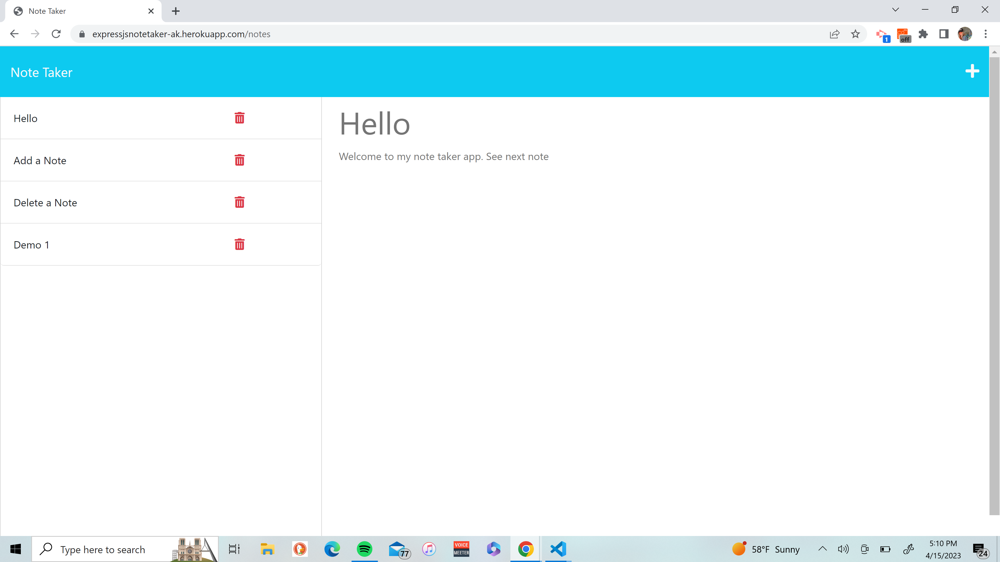

  # Express.js Note Taker
  
  
  

  ## Description
  This is a note taking app that allows the user to enter a note, title and text, and save that note in a json file and to only be deleted by clicking the red garbage can.

  ## Table of Contents
   - [Description](#Description)
   - [Installation](#Installation)
   - [Usage](#Usage)
   - [License](#License)
   - [Contributing](#Contributing)
   - [Tests](#Tests)
   - [Questions](#Questions)

  ## Installation
  1. Install Node JS. 
  2. Copy repository to run app on local host to use as your own note taking app or use Heroku wepage link (https://expressjsnotetaker-ak.herokuapp.com/) to demo the app. 
  3. If cloning repository, require express, fs, generate-unique-id, and path to utilize app on local host.

  ## Usage
  https://expressjsnotetaker-ak.herokuapp.com/

  Homepage ScreenShot
  

  Notes Screenshot 
  

  
  Use this app to take notes that you would like to save or remove at a later time.

  ## License 
  
  

  This application is covered by the MIT license.
  
  ## Contributing
  Suggests on making front end more responsive on mobile devices welcomed for further development.

  ## Tests
  N/A

  ## Questions
  Link to GitHub profile: https://github.com/keberlea
  
  If you have questions you can reach me by email at the following address: alicia.keberle@gmail.com
  